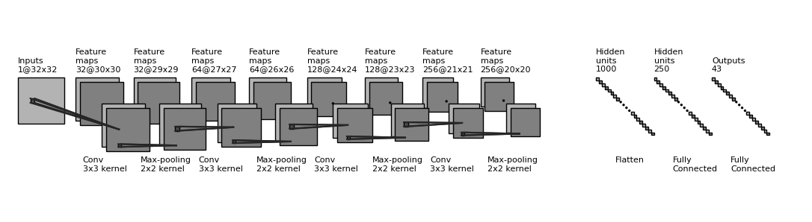
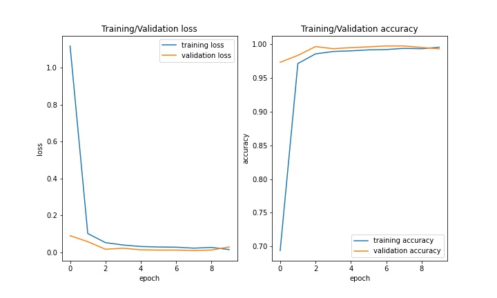
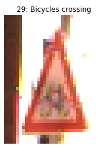
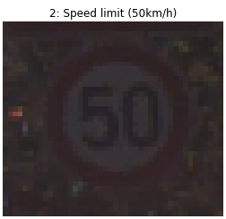

# Traffic-Signs-Classifier

A tensorflow model that classifies traffic sign images with accuracy 99% trained on GTSR dataset.  
You can download the data from [HERE](https://drive.google.com/drive/folders/1WzPw3V9bYl0rC86ATm7zR0rbwYloDDzN)

# Getting Started
### Dependencies
* Python3 install from [HERE](https://www.python.org/downloads/)
* Pip3  
* Jupyter Notebook/Lab install from [HERE](https://jupyter.org/install)  
  
Next dependencies can be installed by running the first code cell in the notebook
* TensorFlow 2
* Pandas
* Numpy
* opencv
* matplotlib

# Model Architecture

This image is created with a python script, you can find it [HERE](https://github.com/Passant-Abdelgalil/draw_convnet)

# Model Performance

# Inference 

`To use the model, set the variable named 'image_path' in the inference section with your image path and run the inference cells`

**Model prediction for some random images**

